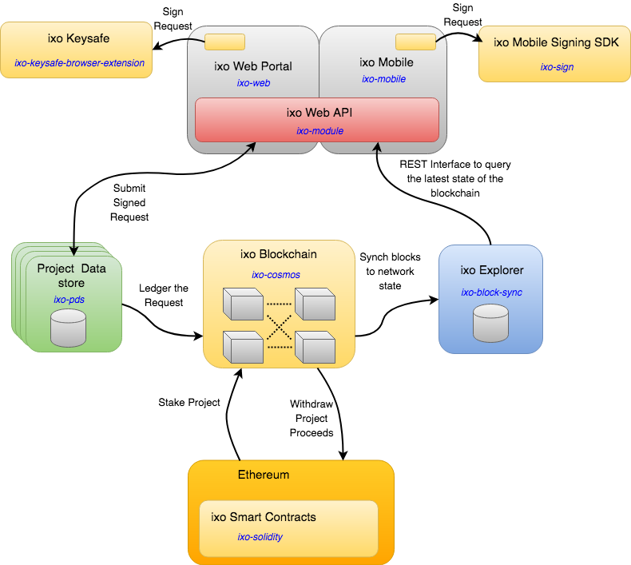

# Architecture

### Design principles

#### \*\*\*\*

### Network topology

#### Internet of Impact

ixo Protocol networks are formed by connecting distributed blockchain nodes in a way that is designed to create a global **Internet of Impact**. This builds on core Internet protocols and standards, but uses additional and repurposed standard, in the same way as Web 2.0 has been adapted to form the Internets of Commerce, Finance, Social Media, Internet of Things, etc. 

The ixo Protocols provide additional common operating protocols and standards that build on foundational new Wrold-wide Web Consortium \(W3C\) standards for Linked-data, Decentralised Identifiers and Verifiable Claims. ixo also builds on emerging Web3 standards for tokenisation, cryptographic message-signing and validation. 

Together, the ixo Protocols provide new ways of:

* **Identifying impact** with decentralised identifiers and high-definition data
* **Verifying impact** with crypto-economic proofs
* **Valuing impact** through tokenisation of impact data assets

The Internet of Impact will become interconnected by the **Inter-blockchain Communication \(IBC\) Protocol**. In future this will also connect across protocols, to a universe of other Web3 networks, including for instance, the Ethereum Network. 

#### Impact Zones

ixo Protcol Networks may be independently configured into zones that have their own security, governance and economic mechanisms. These networks may be public or private, closed or open. The building-blocks are modular, open-source software components that anyone can reuse, build on and repurpose for their own diverse applications and use-cases.

#### Project Nodals

These network zones provide the backbone that supports a reticular mesh of project Nodals. Nodals can be thought of as the cells that are responsible for coordinating, resourcing and incentivising the sense and respond activities of the network. Each Nodal is a containerised, sovereign message processing and project data storage component.

### Network nodes

Validator Node operators of the Sustainability Hub are referred to as **Relayers**. These organisations join a consortium which is responsible for securely operating blockchain nodes and to host the software clients that deliver applications to end-users. Relayers also provide channels to the markets in which they operate, providing support to their customers and end-users with value-adding products and services.

Applications built on ixo protocol networks are delivered as web, mobile, IoT and Precision Oracle services. A collection of open-source ixo client applications is available for developers to build on or adapt to their own business requirements.

The **ixo protocols** are based on core new standards for the decentralised internet from the World-wide Web Consortium \(W3C\).

### Blockchain SDK 

The software clients that provide the communications, data processing and storage capabilities of ixo protocol networks are modules that build on the generic Cosmos SDK, written in Golang.

In addition to the generic Cosmos modules, which have been purposed for the Internet of Impact, the ixo SDK includes application-specific modules, which include:

* Projects Module
* Bonds Module
* Data Assets Module
* Identity Module
* Fiat Banking Oracle Module
* Alpha Oracle Module

 

The ixo blockchain contains the records of evey claim that is issued against a project the the subsequent evaluation of those claims. Each record is validated by a quorum of validator nodes before it is written to the chain and thereafter the record cannot be removed or updated. This data is then aggregated to build out the final states of the projects.

All the information on the ixo blockchain is publicly available through the ixo Explorer. This data includes the project information, stats regarding the project, the stakeholders of the project and the structure of data being captured against the project. All actual claim data is stored in the Project Datastore.

### Privacy of Data 

Much of the data that is captured within a claim is highly sensitive in nature. This data might have specific regulator requirements such as GDPR or maybe the data may not reside outside certain geographical boundaries. In order to comply with this and to also put the data into the hands of the owners of the project we have created the concept of independent data stores for each project.

The ixo Blockchain keeps a link to the location of these project data stores and provides services to the project data that are governed by cryptographic access controls.

### Security 

All requests to that create data or access sensitive data require cryptographic signatures and a capabilities model supports this to provide finer grained access control.

### Message Flows 

#### Update Messages 

In general update requests are created and signed on the front end using our keysafe which holds the private keys for the user. The request with it's signature portion is then passed to the Project Datastore \(PDS\) when it is processed and the results is then ledgered onto the ixo blockchain with hash references back to the original transaction on the PDS. The block containing the request is then processed on the ixo blockchain and the ixo Explorer the synchs this block to the current system state.

#### Read Messages 

When reading publicly availably data a REST call is made to the ixo Explorer that contains the current state of the the blockchain. If private information needs to be accessed than a signed request is submitted to the PDS which will respond with the data if the the signature and capabilities of the user adhere to the policies for that data.

