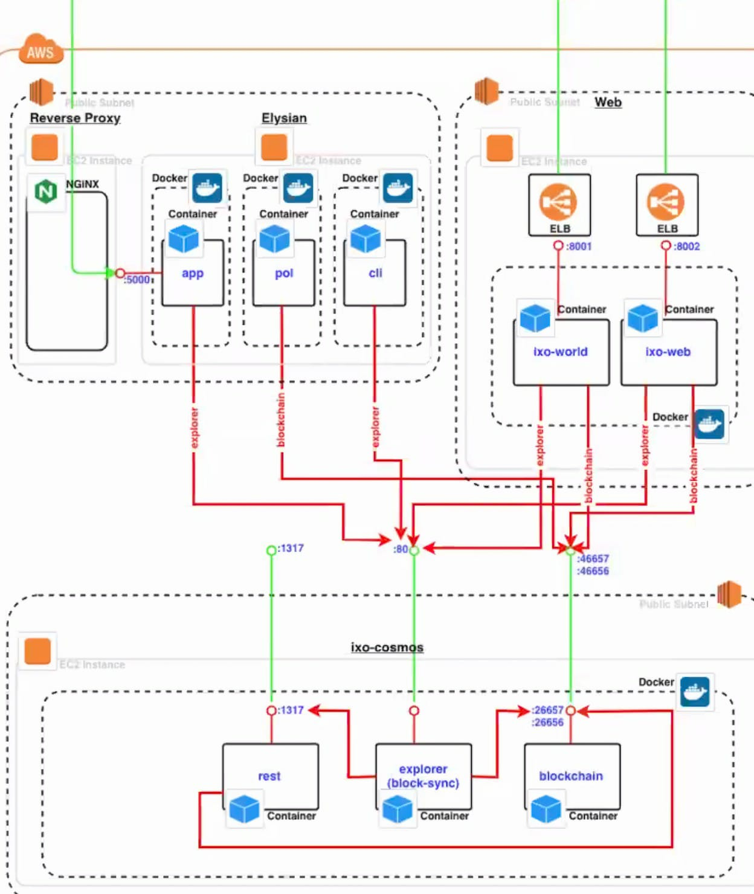

# Step Plan

## 

## Setup Virtual Machines

| Container | Functions | Settings |
| :--- | :--- | :--- |
| Blockchain Client | Validator Node |  |
|  | Explorer \(block-sync\) |  |
|  | Rest API |  |
| Cell Node | Data processing |  |
|  | Data storage |  |
|  | Message queue poller |  |
|  | Command Line Interface |  |
|  | Rest API |  |
| Web client | React Application |  |
|  | Rest API |  |
|  |  |  |

#### 

## ixo cosmos

### 

## 

