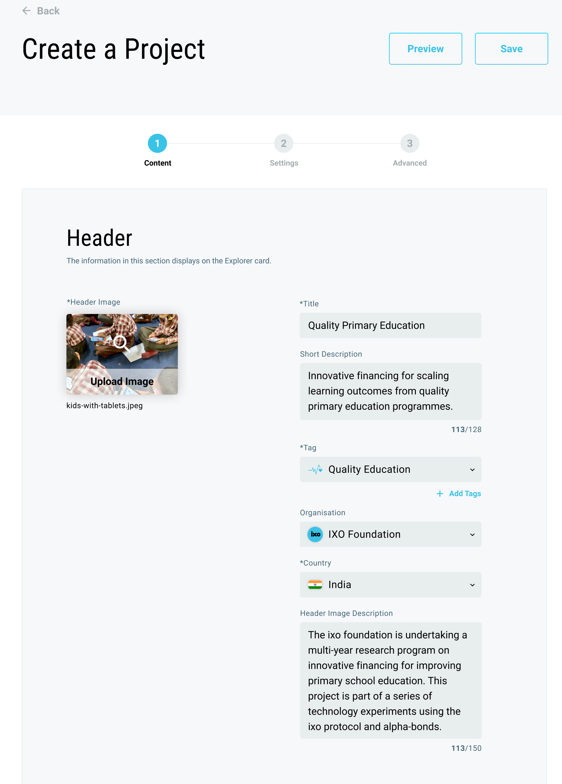
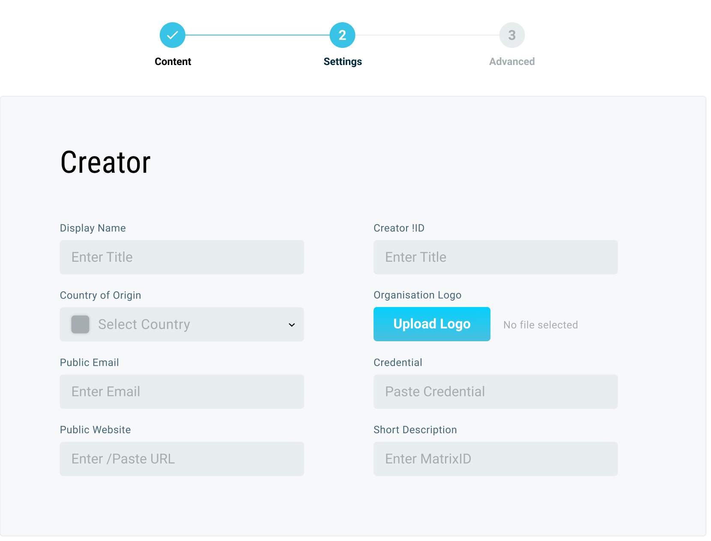

# Create an entity

The simplest way to set up a new entity is to use a pre-configured template as a starting document. Search for a relevant template in the web-client Explorer templates library.

Alternatively, initiate the process of setting up up your entity through the web-client explorer control panel, where you will find the relevant button in the Actions panel to:

* Create a Cell
* Create a Project
* Create an Oracle
* Create a Template
* Create a Data Asset
* Create an Investment


Optionally, developers can choose to configure as JSON Documents, using the latest ixo-Entity JSON Schema and submit this as a signed message through the `ixo-apiModule` Rest API.

Controlled versions of the [document data model](https://github.com/ixofoundation/ixo-protocol/blob/master/entity_document.json) are maintained in Github.


#### What is an Entity?

To understand the concept of an Entity in the Internet of Impact, check out:



## What you will need

Before creating any entity in the Internet of Impact, you must have set up an Impact Wallet and obtained your digital credentials, so that each new entity you create can participate in the web of trust that connects all entities.

To publish your entity onto the Internet of Impact, you will sign a transaction with your cryptographic keys, which are stored in your wallet. A small transaction fee in IXO credits must be paid towards the network costs of processing the data and permanently storing your entity document.


Each entity has its own digital identifier, in the format `did:ixo:29wribufwiuw984feuf98348fj9f4`and an associated record which is referred to as the Entity Document \(which conforms to the W3C DID-DDO standard\).

To create this record, you will need to provide the information described below.  


## Configuring your entity

Each entity has a digital **Entity Document** containing a number of prescribed linked-data Objects. In the following section we will de-mysify these objects and break the document down into 3 sections:

1. Entity Page
2. Settings
3. Advanced Settings

Entity documents can be set up and published using the ixo client software. For this demonstration, we will use the ixo.world web-client interface.

### Configure your entity page content

The Entity Page contains information about your entity that you want end-users will view through web and mobile client software. Think of this as your entity's own web page. 

This information is input and displayed using cards. The default types of cards available are:

* Header card
* Body content card
* Image in article card
* Video embed card
* Table card
* Profiles card
* Linked entities listing card

Cards accept plain text and render this in the pre-formatted style determined by the portal through which the page content is being viewed. 


A limited range of markup elements can be used, including hypertext links, which can be included using the standard convention of `[link text](link URL)`

For the full list of accepted markdown, see this reference page \[TBC\]


### Configure your Entity Settings

Settings are what define the metadata and operating parameters for your entity. Using the ixo web-client, you can be assisted by the ixo AI Assistant to complete these configurations, which include:

* Creator identity, brand and credentials
* Owner identity and credentials
* Credentials of the entity
* Operating parameters, such as start and end dates
* Privacy settings and data view permissions
* Filter categories and tags
* Claims templates for a range of claim types associated with the entity

### Configure Advanced Settings

In this section, you will provide objects such as:

* Cell-node binding which determines where the entity data is stored
* Associated entities that are linked to this entity, for mapping relationships
* Public keys for authentication, message signing and encryption
* Services and their associated endpoints

