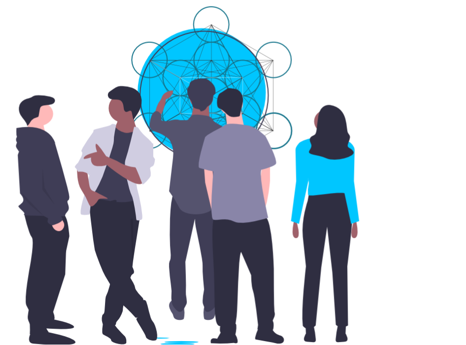

# Cells and Cell Nodes

## Cellular organisations

**Cellular organisations** \(Cells\) are a highly effective coordination mechanism for people to self-organise and self-govern towards achieving a common mission. By definition, cells are decentralised, autonomous, locally responsive, adaptable, hyper-networked, intelligent and purpose-driven. They are highly suitable for virtual and remote teams to work together and share common resources.

[Cellular organisational structures](https://en.wikipedia.org/wiki/Cellular_organizational_structure) are common in nature. Think about how human immune cells sense and respond to threats with targeted precision. Immune cells signal other systems, amplify their responses through replication, produce neutralising or catalytic antibodies and build cellular memory. Each of these has strong analogies with digitally-enhanced cellular organisations.

Cellular organisations are taken to a whole new level in the Internet of Impact. Cells now benefit from the capabilities of digital communication tools, stateful data, programmable capital and networked intelligence-sharing. 

#### Cellular organisations can build a digitally-enhanced immune system for humanity. 

## **Cell nodes**

**Cell nodes** are the digital infrastructure for all types of cellular organisations. These are decentralised, autonomous data stores with digital agency and cryptographic signing capabilities.

Cell nodes enable data to be communicated quickly and securely through [webs of trust](https://en.wikipedia.org/wiki/Web_of_trust). All participants in a cell have access to the same information and share intelligence both within their own cell node and with other organisations, through Internet of Impact networks .

The digital artefacts created by a cell \(such as Project Documents\) are stored in the node as stateful records which are referenced in a distributed ledger. Public metadata are stored using the [Interplanetary File System](https://ipfs.io) \(IPFS\). This allows cell nodes to retain a form of memory that can be [stigmergically](https://wiki.p2pfoundation.net/Stigmergy) shared and rapidly amplified when cells need to be replicated or re-activated.

### The capabilities of cell nodes

Cell nodes have powerful built-in Web 3.0 capabilities, such as:

* Stateless validation of data entering the cell node.
* Hash-chain data storage, secured by a public blockchain ledger.
* Publicly accessible file storage that is content addressable and tamper-proof.
* Decentralised authentication using cryptographic identifiers and provable credentials.
* Cryptographic message signing.

Cell nodes also connect to the univers of Web 2.0 services through conventional application-programming interfaces \(APIs\).

### The features of cell nodes

Cell nodes are configured to provide cellular organisations with powerful tools that can be used 'out of the box'. Cell nodes also connect through the Internet of Impact to third-party data, application extensions and integrations.

#### Core cell node features currenty include:

* Projects
* Secure peer-to-peer communication
* Precision Oracles
* Data marketplace
* Alpha Bond funding
* Agent credentialing
* Token issuance

#### Extended Cell Node features will include:

* Dispute resolution
* Crowd-funding
* Prediction markets
* Bounties
* Blockchain Accounting
* Legal agreements

## Purpose of a cell

The purpose of a Cell defines how this will operate in terms of membership, size, location, lifespan, scope of projects it undertakes and other types of organisational characteristics. A Cell Node is configured to fit the purpose of a cell. 

The founder/s of a cell define its purpose - usually with an explicit mission statement. 

**Examples of cell types and their primary purpose:**

| Cell Type | Purpose |
| :--- | :--- |
| Citizen Cell | Mobilise citizen action towards a common cause. |
| Hackathon Cell | Hack a prototype solution for a specific challenge. |
| Procurement Cell | Negotiate the supply of goods/services in an accountable and transparent way. |
| Investment Cell | Form and allocate capital for debt and/or equity investments. |
| Startup accelerator Cell | Support ventures to find product-market fit and deploy their value propostions. |
| Taskforce Cell | Tackle a specific task with a defined mandate and deliverable. |
| R&D Cell | Research and develop novel solutions though an experimental process. |
| Cooperative Cell | Facilitate broad economic stake-holding in the supply and/or demand of goods and services. |
| Mutual Credit Cell | Form and allocate capital through a peer-to-peer marketplace. |


To view more Cell types and understand the range of purposes for which these have been formed [explore this portal](https://), or search the Internet of Impact through [ixo.world](https://ixo.world/cells).



Templates for forming different types of Cells can be found in the [ixo.world templates library.](https://ixo.world/templates#cells) This is a good place to begin learning from the community it provides a fast-track way to set up your Cell Node, using proven data models and business logic.


## The mission of a cell

Each cell defines its mission explicitly in terms of credible commitments that can be collectively monitored. Cell commitments are accountable, measurable and verifiable. For instance a Procurement Cell can define its mission as: _"Source and distribute 1,000 Ventilators to provide care for people infected with the Covid-19 virus."_

## Cell agents

Participants in a cell are referred to as Agents. Agents include identified individuals, organisations, software agents and devices.

Agent roles can be broadly categorised as:

* Implementing agents
* Evaluation agents
* Investment agents

Each agent is identified by a self-sovereign digital identifier, with associated verifiable credentials. Credentials are issued by known entities within a web of trust. Every message or transaction an agent sends is signed with their Identity. This ensures a high level of agent accountability, trust and compliance.

Agents are given rights for perform specific roles. They issue verifiable claims which attest to the contributions they make towards the mission of the cell. This makes agents fully accountable. The Cell Node is designed to store agent identifiers and credentials in a way that ensures privacy and protects their personal information.

Cells may incentivise agents with tokenised rewards, which are tracked by the Cell Node. Agents can also be economically penalised for not operating within the rules of the cell.

Find out more about Agents.Cell projects

The participants in a cell pursue their mission by implementing one or more projects. The scope of each project is defined in an immutable Project Document. Project information and all the data collected by every project that the cell implements gets stored in the Cell Node.

The performance of each project is tracked through claims which are submitted by cell agents who are authorised to work on the project. Claims are independenly evaluated and verified \(for instance, by Proofing Oracles\).

Find out more about Projects and Claims Verification.

## Cell sovereignty

Cells are independent, sovereign entities within the Internet of Impact. A Cell Node embodies the digital agency of cells with encrypted identifiers, provable credentials and cryptographic keys for authentication, signing messages and secure messaging.

Each cell operates its own private computational and data storage node. Cell Node software and data can be self-hosted or hosted as a service.

The founder of a cell is the ultimate controller, as they hold the keys to the Cell Node and retain full external access control over the cell's data.

The cell founder decides which agents and services are permissioned to connect with the cell and is able to manage or revoke these permissions. Access and authentication is autonomously managed by the Cell Node, without relying on centralised authentication services. This makes Cell Nodes censorship-resistant.

## The cell founder

The role of a cell founder is to instantiate the cell, manage the keys of the cell and ensure that the call operates effectively.

The founder of a cell can be:

* One or more identified individuals;
* One or more identified organisations;
* A combination of individuals and/or organisations operating through a decentralised autonomous organisation \(DAO\).

Cells are principally organisations of people with digital super-powers. To be successful, participants in a cell need to be well-governed, incentivised and empowered. This requires leadership, cooperation and accountability.

## Cell governance

Once a cell has been formed, it may be governed by the founder/s or by all the participants in the cell. The Cell Founder configures a governance mechanism when the Cell Node is instantiated.

Decisions and actions may be made by the Cell Founder, or by cell agents. The Cell Node provides governance tools for stakeholders to make proposals, vote and pass executable resolutions. These tools are available as Cell Node plug-ins, such as [DAOStack](http://daostack.io) Holographic consensus.

## **Cell incentives**

Cells exist within an economy that broadly had three types of common enterprises, in which cell agents may be incentivised to participate:

* The  **entrepreneurial common** interfaces the cell with external ecosystems and markets.  This common sets financial and monetary policy. It determines the price of cell membership, how the cell is owned and how to distribute capital. Incentives for participation in the entrepreneurial enterprise may be created by issuing and distributing shares or tokens in the cell that embody rights of ownership, economic participation and access to the cell's capital resources. 
* The **production common** produces goods and services though the cooperative efforts of the cell members. As incentives, contributors may be paid for their work or receive shares for the value they have created.
* The **beneficial common** governs the cell's mission, impact goals, operating policies, membership, consensus rules, rights and incentive mechanisms. Voting rights are an incentive for participating in the beneficial common.

## Financing cells

There are many possible ways of raising capital resources for a cell. Operating capital can come from more traditional commercial, philanthropic or peer-to-peer sources. Instruments include grants, venture capital, loans, crowd-funding, mutual credit, etc. Now there are also decentralised financing instruments such as tokenisaton, Alpha Bonds and Qaudratic Funding.

The use of capital by a cell can be transparently tracked and accounted for using the Cell Node's blockchain ledger. This includes a mechanism for tracking financial transactions in firat bank accounts and representing these on the ledger. 

Capital flows can be programmatically allocated and distributed using Alpha Bonds. Conditional payment triggers are linked to provable results. This has tremendous potential for risk-adjusted financing of new ventures and perfomance-based contracts.

## How to set up of a Cell Node

The easiest way to start is with a template. Browse [ixo.world templates](https://app.ixo.world/templates) to find one that fits close enough to the purpose and other characteristics of the cell you want to form. The ixo guide explains this further. 

If you can't find a template that suits your specific needs, start a new cell template with guidance from the ixo-assistant chatbot.

## The costs of operating a Cell Node

The costs of hosting a Cell Node depends on whether this is self-hosted or hosted as a service. For hosted options offered by ixo.world see the [pricing guide](https://ixo.world/pricing).

Registering a Cell Node with a Decentralised Identifier and Cell Document on the Sustainability Hub incurs a negligible transaction fee \(gas\) for writing these records to the blockchain.

Cells can choose to employ services and acquire applications from a growing network marketplace, where the costs are determined by providers. 

